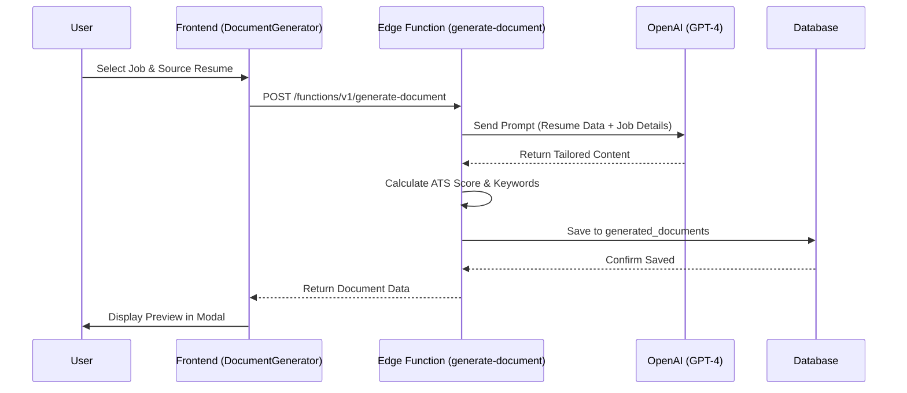
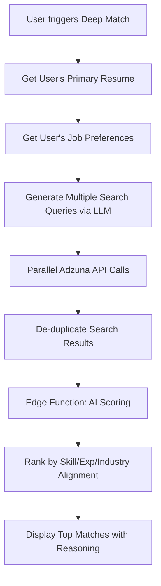
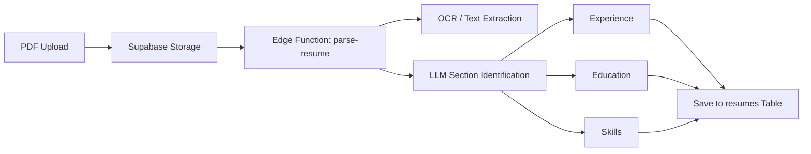
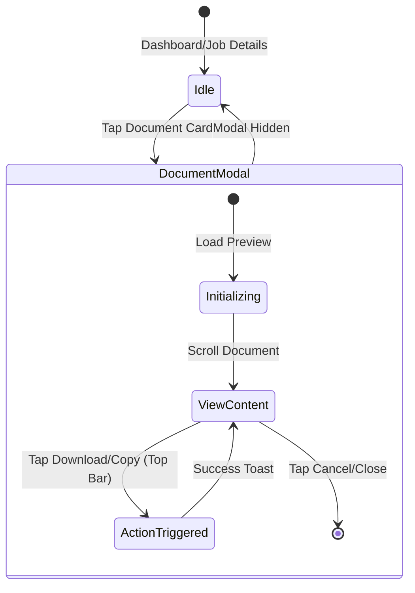

# Workflows & Diagrams

This document visualizes the core business logic and user interaction flows within Job Hunter.

## 1. AI Document Generation Workflow

This flow describes how tailored resumes and cover letters are created.

## 2. Deep Match Search Flow

How the system identifies the best jobs for a user's unique profile.

## 3. Resume Parsing & Enrichment

The process of turning a raw PDF into structured, searchable data.

## 4. Mobile Interaction: Bottom Sheet Modal

We use a "Bottom Sheet" pattern for document previews on mobile to maximize reachability and avoid OS navigation conflicts.

### Key Logic
1.  **Top Sticky Actions**: Primary buttons (Download, Copy, Remix) are moved to the top of the modal on mobile.
    -   *Why?* The mobile app's bottom navigation bar and OS gesture indicators often obstruct bottom-fixed elements.
2.  **Body Scroll Lock**: When active, the background document scroll is disabled (`overflow: hidden`).
3.  **Dynamic Viewport**: Height set to `92dvh` with a `mb-20` margin to sit perfectly above the navigation bar.

### User Interaction Workflow (Mobile)

## 5. PDF Export Optimization

To ensure professional quality, the PDF export uses a customized print CSS engine.

| Attribute | Optimization | Benefit |
|-----------|--------------|---------|
| **Margins** | Reduced to 0.3in - 0.4in | Fits more content on a single page |
| **Paging** | `@page { size: letter; }` | Standardized North American format |
| **Typography** | Font Clamping & Inter/Crimson Fonts | Maintains readability across sizes |
| **UI Striping** | `.no-print { display: none; }` | Removes digital buttons from physical document |
